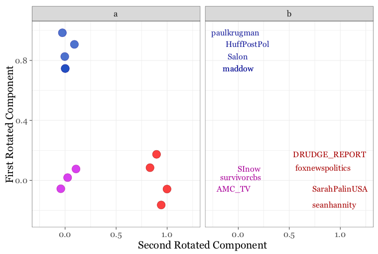
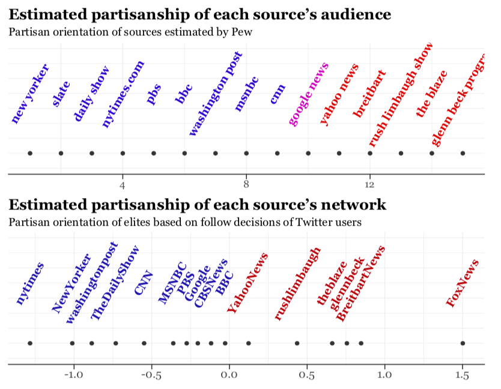
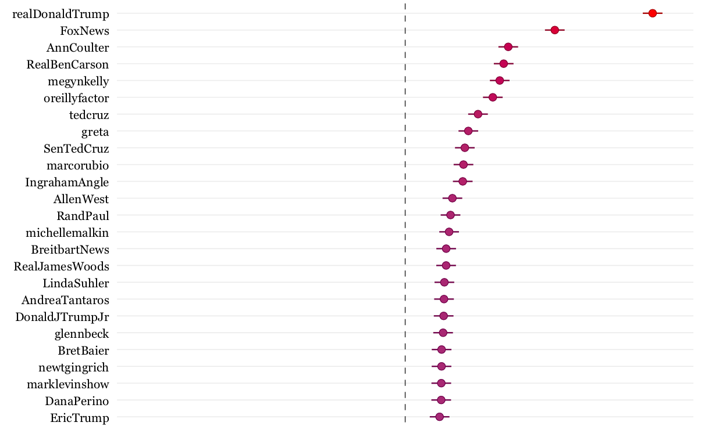
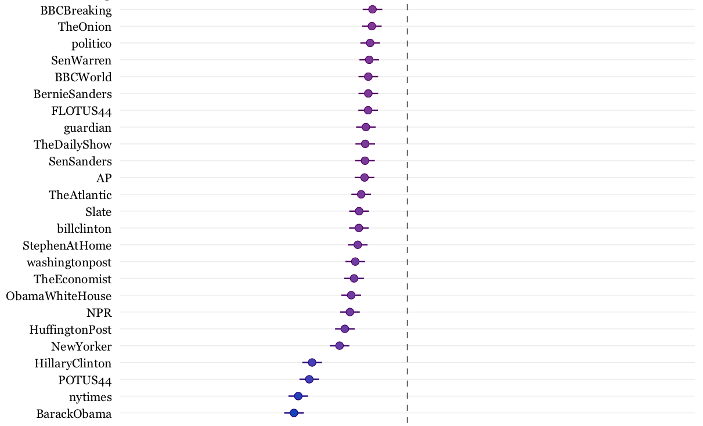
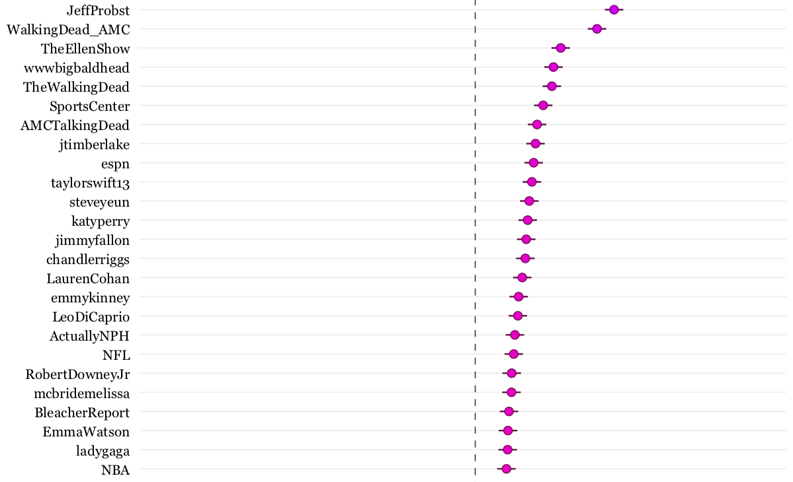
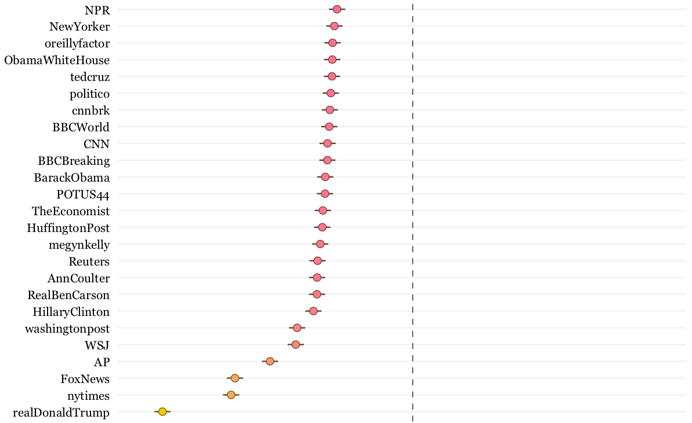

```{r setup, include=FALSE}
knitr::opts_chunk$set(echo = TRUE, eval = FALSE, collapse = TRUE, comment = ">")
options(htmltools.dir.version = FALSE)
htmltools::tagList(rmarkdown::html_dependency_font_awesome())
library(tidyverse)
library(rtweet)
head <- function(x, n = 6) {
  x[sapply(x, is.numeric)] <- lapply(x[sapply(x, is.numeric)], round, 2)
  x <- utils::head(x, n)
  knitr::kable(x, format = "html")
}
```

class: center, middle

Slides available online:


[mkearney.github.io/ica18_estimating](https://mkearney.github.io/dsa_execweek_talk/)


&nbsp;  


Please feel welcome to share on social media:

[\#ica18](https://twitter.com/hashtag/ica18?f=tweets&vertical=default&src=hash) [\#ica_pol](https://twitter.com/hashtag/ica_pol?f=tweets&vertical=default&src=hash)


---

background-size: 150px auto
background-position: 490px 185px, 567px 320px, 644px 185px, 721px 320px, 644px 455px, 567px 50px
background-image: url(img/chr-logo.png), url(img/hexagon-logo.png), url(img/textfeatures-logo.png), url(img/tfse-logo.png), url(img/botrnot-logo.png), url(img/rtweet-logo.svg)

# About Me

**Background**

- PhD in COMS from Kansas
- Asst prof at Mizzou

**Research interests**

- Partisan selective exposure
- Digital and social media

**\#rstats packages**

- Twitter APIs: [**{rtweet}**](https://cran.r-project.org/package=rtweet)
- Text analysis: [**{textfeatures}**](https://cran.r-project.org/package=textfeatures) [**{chr}**](https://github.com/mkearney/chr/)
- Data wrangling/viz: [**{hexagon}**](https://github.com/mkearney/hexagon/) [**{tfse}**](https://github.com/mkearney/tfse/)
- Machine learning: [**{botrnot}**](https://github.com/mkearney/botrnot/)


---

# Partisanship

**Partisanship**: *extent to which one affiliates or associates with a political party* <site>(Kenski, 1980)</site>

+ Differs from political ideology because it describes relationship to political **organizations** and not **ideas**

+ Partisanship is therefore inherently **network-centric**

**Polarization**: *extent to which competing partisans diverge*

+ Mass polarization due to non-partisans, or moderates, are *"tuning out"* of politics by selecting more entertainment media options <site> (Layman & Carsey, 2002; Levendusky, 2013) </site>


<style>
site {
  color: #0051BA;
  opacity: .75;
  font-size: .9em !important;
}
</style>


---

# Twitter

Twitter **conversation networks** of political topics occurred largely within partisan clusters <site> (Himelboim, 2014) </site> 

**Follow-decisions**, or whether a user decides to follows elites, used to estimate the political ideology of [political] elite and mass public users <site> (Barbera, 2015) </site>

+ Bayesian ideal point estimation
+ Using snapshot of user networks, relatively small pool of elite accounts, and single [political] dimension

**How can we translate this method of estimating partisanship (a) in terms more familiar to communication scholars and (b) across multiple dimensions?**

---
class: inverse, center, middle

# Method

---

# Population

Followers (`N = 18,312,863`) of twelve well-known **source accounts** <site> (e.g., Arceneaux et al., 2012, 2013; Holbert et al., 2012; Wicks et al., 2014) </site>

``` r
## GET data via followers/list API
rtweet::get_followers(screen_name, n = 5e6)
```

**Democrat**

+ @maddow, @paulkrugman, @Salon, @HuffPostPol

**GOP**

+ @seanhannit, @Sarah_Palin_USA, @DRUDGE_REPORT, @foxnewspolitics

**Moderate**

+ @SInow, @AMC_TV, @survivorcbs, @AmericanIdol


---

# Sampling

<span>1.</span> Retrieved **users-level data for randomly selected users (N = 60,000)**

``` r
## GET data via users/lookup API
rtweet::lookup_users(users)
```

<span>2.</span> Applied **filters** informed by first-hand experience and previous research <site> (Barberá, 2015; Haustein et al., 2016; Yardi et al., 2009) </site>

+ `protected      | verified`
+ `friends < 50   | friends > 1500`
+ `followers < 50 | followers > 1500`
+ `statuses < 200 | (statuses / ten_days) < 1.0`

<span>3.</span> Randomly sampled 1,000 users from each group

---

# Elite accounts

<span>4.<span> Collected friend **networks** of all 3,000 users

``` r
## GET data via friends/list API
rtweet::get_friends(user)
```

<span>5.</span> Using friend networks, identified **elites** (N = 28,855) if they...

+ were followed by users sampled from at least two different source accounts
+ had at least 400 followers
+ maintained unprotected, or public, Twitter accounts

---

# PCA

+ Three component solution supported by parallel analysis (and Kaiser criteria) and principal component analysis consistent with theorized model, `χ2(25) = 9,108.82`, `p < .001`, `RMSR = 0.054`


<p align="center"></p>


---

# Validity check

Compare to PEW estimates


<p align="center"></p>


---
class: inverse, center, middle

# Results

---

# Republican elites

<p align="center"></p>


---

# Democrat elites

<p align="center"></p>


---

# Least partisan

<p align="center"></p>


---

# Most partisan

<p align="center"></p>


---
class: inverse, center, middle

# Takeaway

---

# Closing thoughts 

**Proposed workflow**

1. Sample followers from partisan and non-partisan groups
1. Identify elite accounts from friend networks of sampled users
1. Estimate partisanship using rotated factor scores from PCA/EFA

**Limitations/future directions**

1. Rate/time limits and collecting followers
1. Consistent versus disciminant follow decisions
1. Leverage machine learning precision


---
class: inverse, center, middle

# That's it \o/


<style>
img.asdf {
  max-width: 116%;
  margin-left: -8%;
}
</style>

